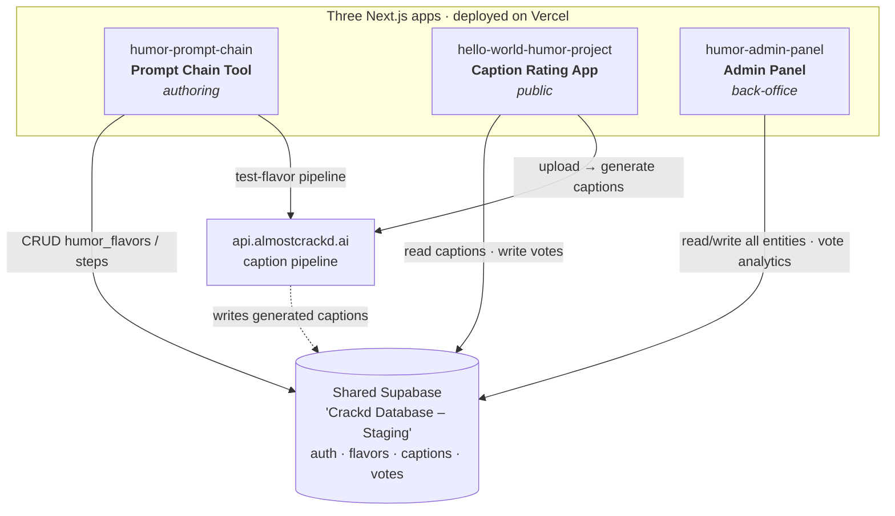

# 👋 Hi, I'm Colin

  
  

## 🎓 About Me

I'm a Computer Science student at Columbia University with a passion for leveraging technology to solve real-world problems. As a Machine Learning Fellow at Cornell Tech (through the Break Through Tech AI program), I'm developing both technical expertise and professional skills to make meaningful contributions in the tech industry.

I'm enthusiastic about building data-driven solutions, creating intelligent systems, and continuously expanding my knowledge. Currently, I'm focused on machine learning foundations, natural language processing, and developing practical AI applications. I'm actively seeking full-time and/or internship opportunities where 
I can apply my skills, collaborate with industry professionals, and contribute to impactful projects.

**🎯 Current Focus:** Machine learning engineering, AI-powered tools, software engineering, and data analytics

---

## 🔧 Tech Stack

### Languages

### AI/ML & Data Science

### Frameworks & Libraries

### Cloud & Tools

### Databases

---

## 🚀 Featured Projects

### 🎭 [The Humor Project] — Full-Stack App Suite
*Three interconnected Next.js apps on a shared Supabase backend*
A suite of three production-deployed web apps forming an end-to-end system for **authoring** AI prompt chains, **generating and rating** image captions, and **administering** the platform. Built over a semester (Spring 2026) for Columbia's COMSW-4995.

- **Tech Stack:** Next.js (App Router, TypeScript), Supabase, Tailwind CSS v4, Vercel
- **The Apps:** [Prompt Chain Tool](https://github.com/Colin-J-Emmanuel/humor-prompt-chain) (authoring) · [Caption Rating App](https://github.com/Colin-J-Emmanuel/hello-world-humor-project) (public voting) · [Admin Panel](https://github.com/Colin-J-Emmanuel/humor-admin-panel) (back-office + analytics)
- **Key Features:** Google OAuth with role-based access gates, full CRUD over a shared schema, a four-step external caption-generation pipeline, and a vote-analytics dashboard
- **Learnings:** Building against a shared multi-tenant database, schema-first development, Next.js server actions, and RLS-aware data flows
This document is the map. Each app has its own repo and its own README; this one explains how the three fit together.

| App | Repo | Role | Audience |
|-----|------|------|----------|
| **Prompt Chain Tool** | [`humor-prompt-chain`](https://github.com/Colin-J-Emmanuel/humor-prompt-chain) | Author & test the *humor flavors* (prompt chains) that drive caption generation | Admins (`is_superadmin` or `is_matrix_admin`) |
| **Caption Rating App** | [`hello-world-humor-project`](https://github.com/Colin-J-Emmanuel/hello-world-humor-project) | Public-facing: browse AI-generated captions, sign in, and upvote/downvote them | Everyone (voting requires sign-in) |
| **Admin Panel** | [`humor-admin-panel`](https://github.com/Colin-J-Emmanuel/humor-admin-panel) | Back-office CRUD over the domain + vote analytics | Admins (`is_superadmin` only) |

---

## How they relate

The three apps don't call each other directly. They're related because they **share two things**: one Supabase database and one external caption-generation API. That shared backbone is what makes them a suite rather than three unrelated projects.

### The data flows in a loop

1. **Author** — In the **Prompt Chain Tool**, an admin defines a *humor flavor*: an ordered chain of LLM steps stored in `humor_flavors` / `humor_flavor_steps`. They can test a flavor end-to-end against the caption pipeline before relying on it.
2. **Generate** — Those flavors drive caption generation. When an image runs through the pipeline (`api.almostcrackd.ai`), the generated captions land in the shared `captions` table, linked back to the flavor via `humor_flavor_id`.
3. **Rate** — The public **Caption Rating App** surfaces those captions, ranks them by net votes, and collects up/down votes into `caption_votes`.
4. **Oversee** — The **Admin Panel** sits across everything: CRUD over the domain entities, plus an Insights view that aggregates the votes the rating app collected.

So the Prompt Chain Tool feeds the captions, the Rating App scores them, and the Admin Panel watches the whole pipeline — all through the one shared database.

---

## Shared backbone

- **One Supabase project** — "Crackd Database – Staging," shared across every student in the course. Its schema and RLS policies are **course-owned and not modified by any of these repos**. Every app was built schema-first: exact table/column names confirmed via `information_schema` queries before writing code.
- **One external API** — `api.almostcrackd.ai`, a four-step caption pipeline (presigned URL → S3 PUT → register image → generate captions), authorized with the signed-in user's Supabase JWT. Used by the Prompt Chain Tool (to test a flavor) and the Caption Rating App (to caption an uploaded image).

## Shared stack

All three apps use the same toolchain:

- **Next.js** (App Router, TypeScript) with auth gating in `proxy.ts` (Next.js 16's `middleware.ts` replacement)
- **Tailwind CSS v4**
- **Supabase** via `@supabase/ssr` (separate server + browser clients)
- **Vercel** for deployment (Deployment Protection off; submissions use commit-specific URLs)
- Google OAuth via Supabase, with per-app authorization gates

---

## Course context

Built across the semester as three project milestones:

- **Project 1** (Assignments 1–5): Caption Rating App
- **Project 2** (Assignments 6–7): Admin Panel
- **Project 3** (Assignment 8 + capstone): Prompt Chain Tool

Each repo's own README has the full feature list, local-setup steps, and an Incognito smoke test.

### 🤖 [Terminal Coding Agent](https://github.com/Colin-J-Emmanuel/terminal-coding-agent)
*AI-Powered Development Assistant*

A sophisticated terminal-based coding agent that interprets natural language instructions and executes code safely using Claude AI. This project demonstrates practical application of LLM integration and secure code execution.

- **Tech Stack:** Python, Claude AI API, subprocess management
- **Key Features:** Natural language to code translation, sandboxed execution environment, error handling and debugging assistance
- **Impact:** Streamlines development workflow by enabling conversational programming
- **Learnings:** API integration, security best practices, prompt engineering

### 📊 [GTA Online Player Behavior Analysis](https://github.com/Colin-J-Emmanuel/gtao-datathon-analysis)
*Data Science Competition Project - Break Through Tech x Rockstar Games Datathon 2025*

Led data analysis for the Break Through Tech Datathon in partnership with Rockstar Games, exploring player behavior patterns in GTA Online. This project showcases end-to-end data science workflow from exploration to insights.

- **Tech Stack:** Python, Pandas, NumPy, Matplotlib, scikit-learn, Jupyter Notebook
- **Methodology:** Exploratory data analysis, feature engineering, statistical modeling, data visualization
- **Results:** Identified key player engagement patterns and provided actionable recommendations for game design
- **Collaboration:** Worked in a team environment with version control and code reviews

### 🎓 [Machine Learning Foundations Portfolio](https://github.com/Colin-J-Emmanuel/colin-btt-ml-portfolio)
*Cornell Tech Break Through Tech AI Program*

Comprehensive collection of machine learning projects completed through Cornell Tech's ML Foundations course, demonstrating proficiency in core ML concepts and algorithms.

- **Tech Stack:** Python, scikit-learn, Pandas, NumPy, Jupyter Notebook
- **Topics Covered:** 
  - Supervised learning (regression, classification)
  - Unsupervised learning (clustering, dimensionality reduction)
  - Model evaluation and validation
  - Feature engineering and selection
- **Highlights:** Hands-on implementation of ML algorithms, data preprocessing pipelines, and model optimization

---

## 📈 GitHub Activity

  
  

  

**📊 Contribution Highlights:**
- Actively maintaining personal projects with regular commits and updates
- Contributing to collaborative coursework and team projects
- Building a portfolio of data science and machine learning applications
- Consistent learning demonstrated through project evolution and skill development

---

## 🎯 What I'm Learning

As a Break Through Tech AI Fellow at Cornell Tech and computer science student at Columbia University, I'm continuously expanding my skill set:

- **Advanced Machine Learning:** Deep learning, neural networks, and model optimization techniques
- **Natural Language Processing:** Text analysis, sentiment classification, and language model applications
- **Software Engineering Best Practices:** Clean code, testing, documentation, and collaboration workflows
- **Data Engineering:** ETL pipelines, data warehousing, and scalable data processing
- **Professional Development:** Technical communication, project management, and industry best practices

---

## 🏆 Certifications & Programs

- **Break Through Tech AI Fellow** - Cornell Tech
  - Intensive machine learning foundations program
  - Industry collaboration and mentorship
  - Real-world project experience with tech companies

---

## ⚽ Beyond the Code

When I'm not coding or analyzing data, you can find me:
- **On the field:** Playing soccer—taught me the importance of teamwork, strategy, and staying focused under pressure
- **At the gym:** Maintaining discipline and setting incremental goals, skills that translate directly to tackling complex coding challenges
- **Exploring stories:** Watching films and series to unwind and appreciate narrative structure and character development

I believe staying active and engaged outside of tech makes me a better problem-solver and collaborator!

---

## 💼 Open to Opportunities

I'm actively seeking full-time roles, and summer 2026 internship opportunities if given the chance, in:
- **Data Science & Analytics**
- **Machine Learning Engineering**
- **Software Engineering (focus on backend/data)**
- **AI/ML Research & Development**

I'm particularly interested in roles where I can apply my technical skills to solve meaningful problems, work with diverse teams, and continue learning from experienced professionals in the industry.

---

## 📫 Let's Connect!

I'm always excited to discuss technology, data science, collaboration opportunities, or just connect with fellow developers and learners!

- **Email:** c.j.emmanuel@columbia.edu | colinjemmanuel@gmail.com
- **LinkedIn:** [linkedin.com/in/colin-j-emmanuel](https://www.linkedin.com/in/colin-j-emmanuel)
- **Location:** New York City, NY

---

  <i>⚡ Fun Fact: I fell down the ML rabbit hole trying to build a movie recommendation system. Turns out, mimicking Netflix and Spotify is harder than it looks—but that failed first attempt hooked me on machine learning!</i>

  Last updated: November 2025

